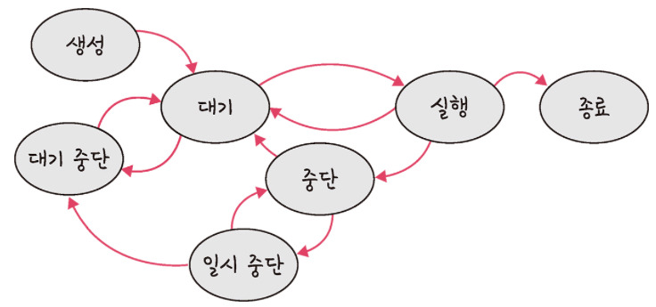

## 생성 상태 (create)

생성 상태는 **프로세스가 생성 된 상태**를 의미합니다. `fork()` 혹은 `exec()` 함수를 통해 생성되고 이때 PCB가 할당 됩니다.

### fork()

fork()는 부모 프로세스의 주소 공간을 그대로 복사해 자식 프로세스를 생성하는 함수입니다. (aka github repo fork...)  
주소 공간만 복사하고 부모 프로세스의 비동기 작업은 상속하지 않습니다.

### exec()

exec()는 '새롭게' 프로세스를 생성하는 함수입니다.

> **PCB란? (Process Control Block)**
>
> 운영체제가 각 프로세스의 상태와 정보를 저장하기 위해 사용하는 **자료구조(구조체 형태)** 인데, 쉽게 말해서 '프로세스의 주민등록카드' 입니다.  
> 프로세스 하나가 생성 될 때마다 운영체제는 그 프로세스에 대한 정보(이름, 상태, 주소, 레지스터 등)를 PCB에 저장하고 관리합니다.  
> 또, 문맥 교환 시, 운영체제는 현재 프로세스의 상태를 PCB에 저장하고, 다른 프로세스의 PCB에서 상태를 읽어와 다시 실행 👉 PCB는 문맥을 저장하고 복원하는 핵심 저장소 역할을 해줍니다.
>
> - **PID** : 프로세스 ID (고유 식별자)
> - **프로세스 상태** : 실행 중, 준비 상태, 대기 상태 등
> - **Program Counter** : 다음에 실행할 명령어 주소
> - **CPU 레지스터 값** : 문맥 교환 (context switch)을 위해 저장
> - **메모리 정보** : 코드, 데이터, 스택 영역 정보 등
> - **파일 정보** : 열려 있는 파일 디스크립터 등
> - **입출력 상태** : I/O 장치와의 연결 상태 등

## 대기 상태 (ready)

대기 상태는 메모리 공간이 여유로우면 할당 받고 아니면 대기합니다. CPU 스케줄러로부터 CPU 소유권이 넘어오기 기다리는 상태에요.

## 대기 중단 상태(ready suspended)

대기 중단 상태는 메모리 부족으로 일시 중단된 상태입니다.

## 실행 상태(running)

실행 상태는 CPU 소유권과 메모리를 할당 받고 인스트럭션을 수행 중인 상태입니다. CPU burst가 일어났다고도 합니다.

## 중단 상태(blocked)

중단 상태는 이벤트가 발생하고 기다리며 프로세스가 차단된 상태이며, I/O 디바이스로 인터럽트가 일어나면 발생하기도 합니다.

## 일시 중단 상태(blocked suspended)

일시 중단 상태는 대기 중단과 유사합니다. 중단되고 다시 실행되려고 했지만 메모리가 부족해서 일시 중단된 상태에요.

## 종료 상태(terminated)

종료 상태는 메모리, CPU 소유권을 모두 놓고 가는 상태입니다. 종료에는 자연스러운 종료, 부모 프로세스가 자식 프로세스를 강제 종료시키는 비자발적 종료(abort)가 있어요.

> **비자발적 종료가 발생하는 경우**
>
> 1. 자식 프로세스가 할당된 자원의 한계치를 넘을 때
> 2. 사용자가 process.kill 등 명령어로 프로세스를 종료할 때
